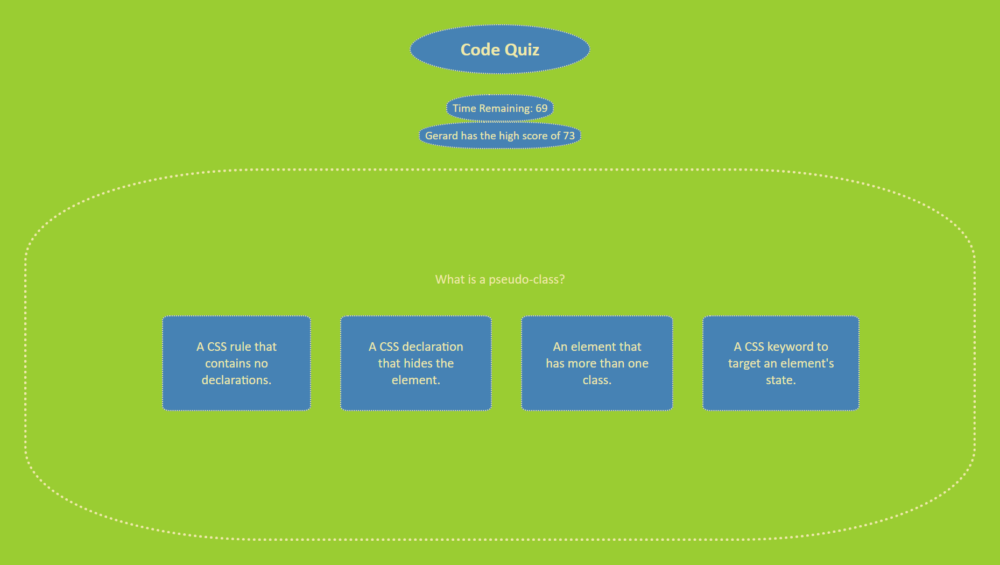

Code-Quiz by Gerard Mennella

# Summary
This page is designed as a timed coding quiz that saves your best time and displays it as a high score.

# Code Breakdown
The HTML is simple with a few divs designed to be modified in javascript

The CSS is designed to make the page simple and straightforward for optimized use. The media queries alter the display to better suit smaller displays.

As for the javascript...

First, an array is created with multiple objects. These objects contain a Question, an array of 4 possible answers, and the answer to the question that matches the answer in the array.

Next, variables are declared that pull html elements, create new elements, and set values for later use.

Next, an If/Else statement is created to determine how to pouplate the highscore div. If there is now high score yet it will read No high score data. Otherwise it will display the name of the person who has the high score, followed by "has the high score of" and the score. This information is pulled from local storage.

Next, the timer div is filled with text content

Next, a click listener is added to the start quiz button that both starts the quiz and the timer. The timer decreases with a set interval function or by 5 seconds when a question is answered wrong. When the timer reaches zero or the questions are complete the the timer is cleared and the endQuiz function triggers.

Next, the quiz function is declared. When the function triggers the content in the quizArea is erased. The area is then populated by the current iterator from the array. The questions and options are then cycled through and appended accordingly. There is a click listener on each of the options that triggers the validate function.

Next, the validate function targets what is clicked. if it is a list item it will evaluate if the text content matches the corresponding answer. An If/Else then either populates the result div with correct or incorrect response. If incorrect a time penalty ensues. The iterator is then advanced to the next and the quiz is repeated until the length is reached. The result is appended at the bottom

Finally, the endQuiz function is written. The quizArea is then emptied and multiple elements are created and appended. A notification of End Quiz appeares above a form that asks for your name. When a name is entered and submit is pressed a function triggers that saves your name and score to local storage. If your score is higher than the current highscore it replaces it, otherwise a notification appears to inform that you have not beat the high score.

# Deployed Application
https://gerardmennella21.github.io/Code-Quiz/

# ScreenShot
